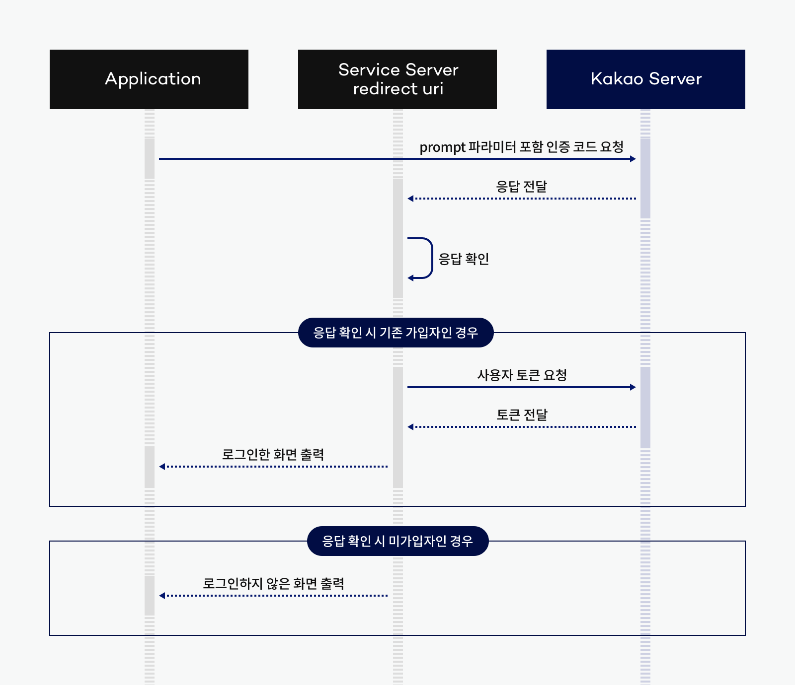
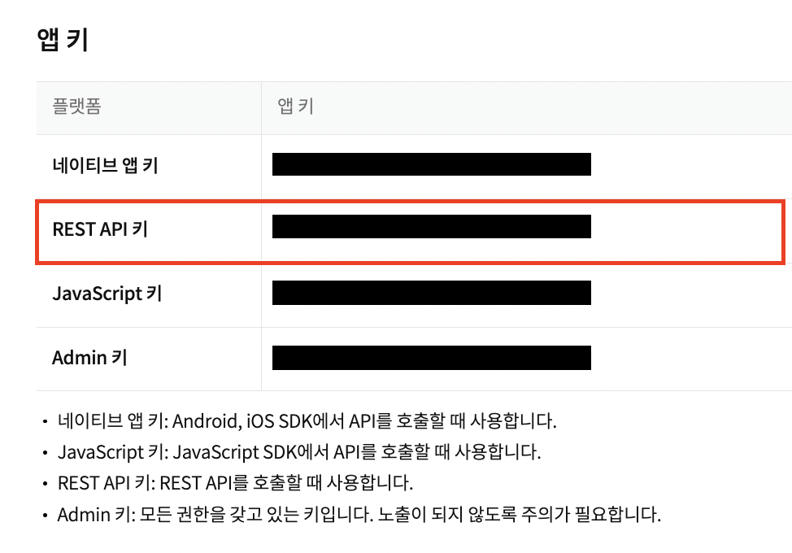
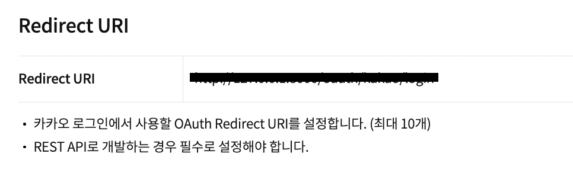

# 카카오 로그인 연동
## Framework - folder
- FastAPI - fastapi
- Django - django_based/

### 1. 카카오 자동 로그인 과정


### 2. 앱 키 발급 및 Redirect URI 설정
- 앱 키(=Client ID/REST API KEY)

- Redirect URI 설정(필수)


### 3. 토큰 발급 요청 예시
* AUTHORIZE_CODE는 인가 코드 받기 요청으로 얻은 인가 코드임
```
curl -v -X POST "https://kauth.kakao.com/oauth/token" \
    -H "Content-Type: application/x-www-form-urlencoded" \
    -d "grant_type=authorization_code" \
    -d "client_id=${REST_API_KEY}" \
    --data-urlencode "redirect_uri=${REDIRECT_URI}" \
    -d "code=${AUTHORIZE_CODE}"
```

## Reference
<a href='https://developers.kakao.com/'> kakao developers